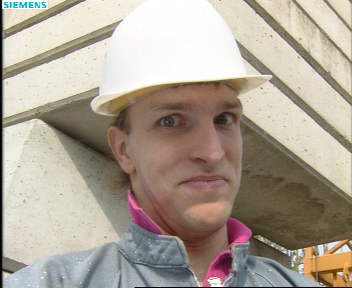

Used Image Samples:
=======
 foreman100 as target frame(grayscale)
 foreman101 as anchor frame(grayscale)

Homework: DCT & Quantization
=======

Terminal Output
-------------
(Mask)
> ``new_hw> ./dct foreman100.bmp ``\\
> PSNR: 25.199335\\
> PSNR: 28.480326\\
> PSNR: 31.748827\\
> PSNR: 37.141102\\

(Quantization)

> PSNR: 36.912891\\
> PSNR: 34.283901\\
> PSNR: 32.069393\\
> PSNR: 29.646105\\
> PSNR: 26.986332\\
> PSNR: 23.879482\\

Image Output
-------------
* Mask
 4 coefficients, PSNR = 25.199335
 8 coefficients, PSNR = 28.480326
 16 coefficients, PSNR = 31.748827
 32 coefficients, PSNR = 37.141102

* JPEG
 Scale Factor = 0.5, PSNR = 36.912891
 Scale Factor = 1, PSNR = 34.283901
 Scale Factor = 2, PSNR = 32.069393
 Scale Factor = 4, PSNR = 29.646105
 Scale Factor = 8, PSNR = 26.986332
 Scale Factor = 16, PSNR = 23.879482

<pre>
From PSNRs above we can tell that to attain a PSNR ``>= 30dB``, a coefficient number of 16 / scale factor of 2 is required.
</pre>

Homework: Coding
=======

Image Output
-------------
* EBMA Predicted Image
 PSNR = 34.537937

Terminal Output
-------------
> ``new_hw> ./coding foreman100.bmp foreman101.bmp ``
> PSNR: 34.537937
> Direct Method: 
> Variance: 4006.260742
> Non-zero Coefficient: 13758
> 
> Diff Method: 
> Variance: 57.480568
> Non-zero Coefficient: 6052
> 
> EBMA Residual Method: 
> Variance: 23.048000

<pre>
From the variances & coefficient number data above, conclusion can be drawn that coding efficiency Method 3(Motion Compensation) > Method 2(Diff Image) > Method 1(Direct).
</pre>
